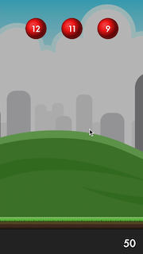

#WWDC 2021 - Perfect0

This playground has been developed by Deniz Karakay for Swift Student Challenge 2021🎉

### Welcome to the Perfect0!
 
Perfect0 is a game to:

1.  Entertain people,
2.  Support them to practice more,
3.  Show how easy math is,
4.  Demonstrate how easy four operations are,
5.  Force people to do multitasking
 
It is a **PERFECT** game for everyone!
 
###  HOW TO PLAY❓
*  👉🏻 Check remaining number on the bottom right, you need to decrease it to reach 0️⃣
*  👉🏼 Remove undesirable numbers or operations by clicking them.
* 👉🏽 Let one of the numbers or operations reach the ground. This becomes your operation.
* 👉🏾 You are able to see your operations, in the operation bar on the bottom left.
* 👉🏿 Your operation result will be decreased from the remaining number.
* 👉 Keep going until you reach perfect 0 🎉
 
###  PLAY NOW ▶️:
 Just click "Run My Code" button!
 To have a better performance, you should click "Run Options" button and disable "Enable results". 
 
 Have fun becoming Perfect0! 
 
###  THANKS TO 😊 
 My family,
 My brother (Cem Karakay),
 
*  For Art:
 - Colored Spheres (athile)
 - Kenney (Puzzle Pack)
 - Click icon (icon8)
 - Background (bevouliin.com)
 
*  For Sound Effects:
 - Failure 2 (Leszek_Szary)
 - Button Selected (StavSounds)
 - Grand Entrance Intro (metrostock99)
 - Removing a Cap from an Asthma Inhaler (Natty23)
 
*  For Background Music:
 - Happy Arcade Tune (rezoner)

*  OpenGameArt
*  FreeSound
 
 